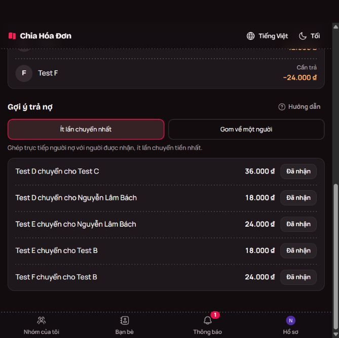
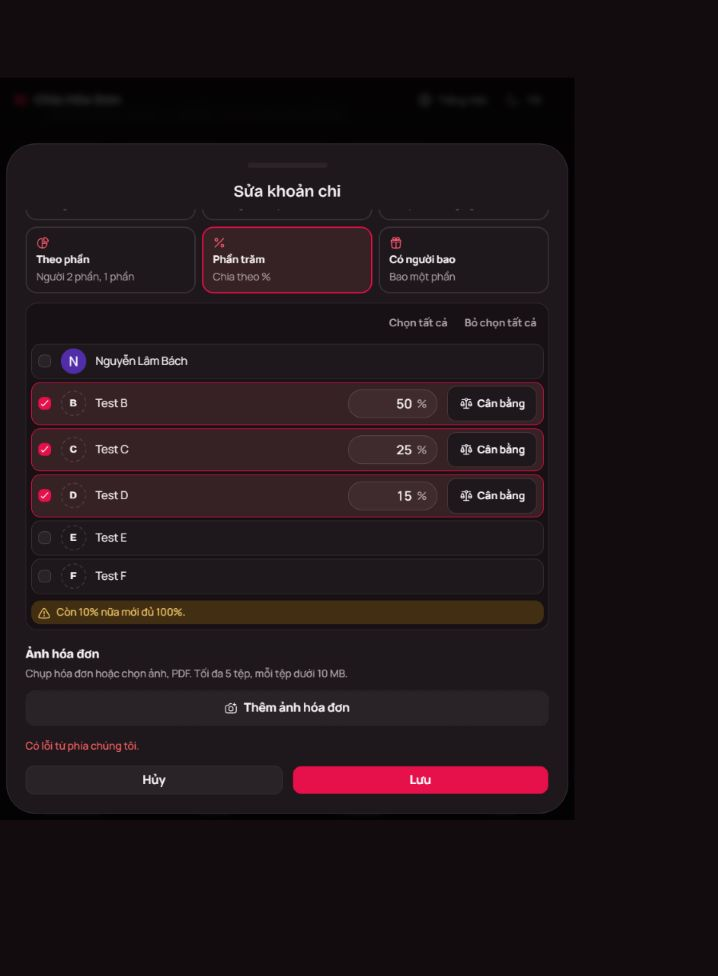

# Kiểm tra chiahoadon.com sau khi đăng nhập

Ngày: 26/09/2026. Kiểm tra trực tiếp qua giao diện bằng tài khoản do người dùng
đăng nhập, trên nhóm thử riêng **Splitwise-mini - KIEM THU 26-09-2026**.

[Mở nhóm thử](https://chiahoadon.com/groups/a0a38cd6-3834-4c74-b041-870935b37e03/balances)
— cần đăng nhập tài khoản có quyền vào nhóm.

## Kết luận

Website tính đúng phần chi và số dư trong các trường hợp đã thử. Tuy nhiên,
**chế độ đề xuất ít lượt chuyển nhất vẫn có thể đưa ra 5 lượt khi chỉ cần 4 lượt**.
Đã tái hiện trước và sau một khoản hoàn trả từng phần. Module Splitwise-mini cho
4 lượt với cùng số dư; các phương án đều bảo toàn tiền và đưa số dư về 0.

Đây là kiểm thử đầu vào/đầu ra của website đang chạy, không phải kiểm tra mã nguồn
máy chủ. Kết quả không xác định chính xác website dùng thuật toán nào và không
có nghĩa mọi bộ dữ liệu của nó đều kém tối ưu. Bộ thử này có 6 người; chưa kiểm
thử trực tiếp nhóm 20 người trên website. Kiểm thử 20 người trước đó là của module
Splitwise-mini cục bộ.

## Bộ dữ liệu chứng minh 5 lượt có thể giảm thành 4

A là chủ tài khoản. B–F là các khách Test B–Test F. Mỗi người thanh toán một khoản
dùng chung, và cả sáu cùng chia đều từng khoản:

| Người | Đã thanh toán | Phần phải chịu | Số dư |
|---|---:|---:|---:|
| A | 108.000đ | 60.000đ | +48.000đ |
| B | 102.000đ | 60.000đ | +42.000đ |
| C | 96.000đ | 60.000đ | +36.000đ |
| D | 6.000đ | 60.000đ | −54.000đ |
| E | 12.000đ | 60.000đ | −48.000đ |
| F | 36.000đ | 60.000đ | −24.000đ |
| **Tổng** | **360.000đ** | **360.000đ** | **0đ** |

Các số tiền được chọn chia hết cho 6 để phép đối chiếu số lượt không bị ảnh hưởng
bởi phân bổ đồng lẻ. Hai khoản đầu đã được sửa trong lúc chuẩn bị bộ thử; số liệu
ở bảng là số liệu cuối cùng đã lưu trước khi kiểm tra số dư.

| Website: 5 lượt | Số tiền | Splitwise-mini: 4 lượt | Số tiền |
|---|---:|---|---:|
| D → C | 36.000đ | D → B | 42.000đ |
| D → B | 18.000đ | D → C | 12.000đ |
| E → B | 24.000đ | E → A | 48.000đ |
| E → A | 24.000đ | F → C | 24.000đ |
| F → A | 24.000đ | | |
| **Tổng hoàn trả** | **126.000đ** | **Tổng hoàn trả** | **126.000đ** |

Không thể giảm xuống ba lượt: có ba người nợ và ba người được nhận, nên ba lượt
đòi hỏi mỗi người ghép đúng một người đối diện với số tiền bằng nhau. Chỉ có cặp
A/E thỏa mãn; không thể ghép đủ ba cặp. Có phương án bốn lượt nên bốn là cực tiểu.

Sau đó đã ghi một khoản hoàn trả **mẫu** E → A 6.000đ. Số dư A/E đổi thành
+42.000đ/−42.000đ; các thành viên khác giữ nguyên. Website vẫn đưa ra năm lượt:
D → C 36.000đ, D → A 18.000đ, E → A 24.000đ, E → B 18.000đ, F → B 24.000đ.
Module cục bộ tiếp tục tìm được bốn lượt. Ảnh dưới là trạng thái sau khoản mẫu này:

[Dữ liệu tái hiện](../examples/chiahoadon-audit-fixture.mjs) lưu cả hai trạng thái
và danh sách chuyển tiền quan sát trên website. Kiểm thử cục bộ xác nhận các danh
sách của website trả đúng tiền, nhưng phương án tối ưu có ít hơn một lượt.

Đã chạy `npm test` sau khi thêm dữ liệu tái hiện: **23/23 kiểm thử đạt**. Đây là
kết quả bộ kiểm thử của Splitwise-mini, không phải số lượng kiểm thử tự động trên
website tham khảo.

## Chức năng đã thao tác và xác minh

| Chức năng | Dữ liệu/thao tác | Kết quả quan sát |
|---|---|---|
| Tạo nhóm | Chủ tài khoản + 5 khách, VND | Lưu thành công, hiển thị đủ 6 người |
| Thêm khoản chi | Sáu người lần lượt trả các khoản chung | Tên người trả, số tiền và phần mỗi người lưu đúng |
| Nhập tiền rút gọn | Nhập 180k ở khoản đầu trước khi sửa | Đọc thành 180.000đ |
| Sửa khoản chi | Sửa số tiền, tên, cách chia nhiều lần | Dữ liệu đã lưu và số dư cập nhật đúng |
| Chia đều có tiền lẻ | 100.000đ cho B/C/D | 33.334đ + 33.333đ + 33.333đ, tổng đúng |
| Chọn người tham gia | Chủ tài khoản trả, chỉ B/C/D chịu chi phí | Lưu được; người thanh toán không bị buộc phải có phần chia |
| Theo phần | 120.000đ, B/C/D theo 2/1/1 | 60.000đ / 30.000đ / 30.000đ, lưu đúng |
| Theo phần trăm | 120.000đ, 50%/25%/25% | 60.000đ / 30.000đ / 30.000đ, lưu đúng |
| Theo số tiền | B/C/D chịu 20.000đ/40.000đ/60.000đ | Tổng 120.000đ, lưu đúng |
| Một người bao một phần | B chịu 60.000đ; C/D chia phần còn lại của 120.000đ | B 60.000đ, C/D mỗi người 30.000đ, lưu đúng |
| Theo món và phí chung | B dùng món 60.000đ; C/D dùng chung món 40.000đ; tổng hóa đơn 120.000đ | Phí 20.000đ phân theo tỷ lệ; B 72.000đ, C/D mỗi người 24.000đ |
| Chi riêng | Khoản 120.000đ do A trả và chỉ chia cho A | Không tạo thêm công nợ; số dư trở lại bộ thử sáu khoản |
| Lịch sử chỉnh sửa | Mở lịch sử của khoản kiểm tra các kiểu chia | Có các lần tạo/sửa và thay đổi cách chia |
| Gom qua một người | Chọn A thu/chi hộ cả nhóm | D/E/F trả A; A trả B/C; số tiền khớp, 5 lượt |
| Hoàn trả từng phần | Ghi E → A 6.000đ qua biểu mẫu đã nhận, có ghi chú kiểm thử | Số dư E tăng 6.000đ; A giảm 6.000đ; cập nhật ngay |
| Thống kê | Sau 7 khoản chi và một khoản hoàn trả mẫu | Tổng chi 480.000đ, đã trả nợ 6.000đ, còn phải trả 120.000đ |
| Chốt sổ | Chốt nhóm thử trong khi còn công nợ | Có nhãn đã chốt, không còn nút thêm khoản chi |
| Mở lại sổ | Mở lại sau khi chốt | Nút thêm khoản chi hoạt động trở lại |

Chi tiết theo món và lịch sử đã lưu trong
[ảnh minh họa](evidence/chiahoadon-2026-09-26/04-items-and-history.png).

## Điểm cần cải thiện khi xây Splitwise-mini

1. **Đề xuất chuyển tiền phải phù hợp với lời hứa trên giao diện.** Khi dùng thuật
   toán chính xác mới ghi là ít lượt nhất; nếu dùng phương án nhanh thì ghi là
   gợi ý hoàn tiền. Module hiện tại đã phân biệt hai trường hợp này.
2. **Báo lỗi nhập liệu ngay tại trường sai.** Khi nhập tổng phần trăm 90%, website
   có lời nhắc còn thiếu 10%, nhưng vẫn cho bấm lưu. Sau đó lưu bị từ chối với
   thông báo lỗi chung từ hệ thống. Không thấy ghi nhận chỉnh sửa không hợp lệ
   trong lịch sử; tỷ lệ hợp lệ sau đó lưu thành công. Splitwise-mini nên chặn lưu
   sớm và nêu rõ tổng hiện tại cùng phần còn thiếu. Đây là vấn đề phản hồi lỗi,
   chưa phải bằng chứng website lưu sai tiền.
3. **Giải thích số dư sau khi hoàn tiền.** Sau E trả A 6.000đ, thống kê A hiển thị
   đã thanh toán 228.000đ và phần phải chịu 180.000đ, nhưng còn được nhận 42.000đ.
   Con số đúng vì A đã nhận 6.000đ; giao diện nên hiện thêm phần đã hoàn trả/đã
   nhận để người dùng không phải tự suy ra.
4. **Phân biệt đã thanh toán cho khoản chi với đã chuyển tiền trả người khác.**
   Trong biểu mẫu và báo cáo nên dùng các nhãn “Ai đã thanh toán?”, “Khoản này chia
   cho ai?”, “Phần của bạn”, “Cần trả”, “Được nhận lại” như người dùng đã yêu cầu.

## Phần chỉ xem giao diện hoặc chưa xác minh hết

- Trang thành viên có tạo link mời, mời bạn bè và thêm khách; đã xác minh việc thêm
  khách khi tạo nhóm, chưa thử người thứ hai gia nhập bằng tài khoản khác.
- Cài đặt có quyền thêm thành viên, duyệt người nhận chỗ khách, cho đính kèm ảnh và
  ba phạm vi sửa sổ. Đã đọc cấu hình; chưa kiểm tra quyền bằng một tài khoản thứ hai.
- Có chia sẻ sổ bằng link chỉ xem. Không bật chia sẻ công khai trong lượt thử này.
- Có các lựa chọn xuất CSV, Excel và ảnh tổng kết. Đã thử kích hoạt CSV và ảnh,
  nhưng công cụ trình duyệt không trả về tệp tải xuống/bản xem trước để đối chiếu.
  Vì thế chưa chứng nhận nội dung file xuất, cũng chưa kết luận chức năng xuất bị lỗi.
- Không nhập tài khoản ngân hàng hay thực hiện chuyển tiền. Chưa xác minh QR với
  ngân hàng, thông báo qua email hoặc luồng người trả báo rồi người nhận xác nhận.
- Chưa thử xóa/hoàn tác, ảnh/PDF đính kèm, góp quỹ, đa tiền tệ và tải đồng thời.
- Chốt sổ đã được kiểm tra ở giao diện, chưa thử cố ý gửi yêu cầu sửa trái quyền
  sau khi khóa; đây không phải đánh giá bảo mật của website.

## Trạng thái nhóm để người dùng xem lại

Nhóm thử vẫn giữ trong tài khoản và **đang mở sổ**, dùng chế độ chuyển trực tiếp.
Nhóm có 6 thành viên, 7 khoản chi mẫu tổng 480.000đ và một ghi nhận hoàn trả mẫu
6.000đ; không có chuyển tiền thực tế. Khoản thứ bảy cuối cùng là khoản chi riêng
của A trị giá 120.000đ, để kiểm tra chi riêng không làm thay đổi công nợ.

Số dư cuối cùng theo thứ tự A–F:
`+42.000, +42.000, +36.000, −54.000, −42.000, −24.000` đồng.
Đã chốt rồi mở lại sổ trong khi thử, nên tài khoản có thể có thông báo nội bộ về
nhóm thử. Không gửi lời mời hoặc tin nhắn cho người khác.

Ảnh bằng chứng nằm trong `evidence/chiahoadon-2026-09-26/`. Ưu tiên ảnh
`09-transfer-suggestions.png` khi đối chiếu số lượt: đây là ảnh chụp một khung nhìn.
Các ảnh toàn trang do trình duyệt ghép có thể lặp vùng cuối trang; không đếm lượt
chuyển bằng phần bị lặp đó. Danh sách chuyển tiền trong báo cáo được đọc trực tiếp
từ giao diện và kiểm tra bằng số lượng điều khiển tương ứng.
